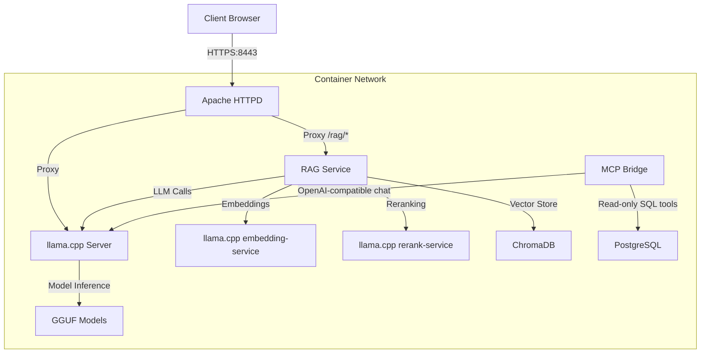

# 🦙 llama.cpp on Podman

A production-ready containerized setup for running **llama.cpp inference server** with **Retrieval-Augmented Generation (RAG)** capabilities. Includes Apache HTTPD reverse proxy, ChromaDB vector store, and an optional **MCP bridge** for safe, read-only PostgreSQL tools.

## ✨ Features

- 🦙 **LLM Inference** with llama.cpp and GGUF models
- 🧠 **RAG System** with semantic search and document Q&A
-  **Security** with HTTPS, authentication, and network isolation
- 🐳 **Containers** with Kubernetes support
- 📁 **Multi-Format Support** for PDF, DOCX, TXT, and JSON documents
- 🧩 **MCP Bridge (optional)**: local-only, read-only PostgreSQL tools for the model

## 🚀 Quick Start

### 1. Setup

```bash
# Create required directories
mkdir -p \
    apache/certs \
    models \
    rag-service/documents rag-service/data/chroma_db rag-service/models \
    mcp-script/postgresql-data

# Set SELinux context (if SELinux is enabled on RHEL/Fedora/CentOS)
# chcon -Rt container_file_t ./rag-service/data/
# chcon -Rt container_file_t ./apache/certs/
# chcon -Rt container_file_t ./apache/conf/
# chcon -Rt container_file_t ./apache/html/
# chcon -Rt container_file_t ./apache/logs/
# chcon -Rt container_file_t ./models/

# Generate SSL certificates
openssl req -x509 -nodes -days 365 -newkey rsa:2048 \
  -keyout apache/certs/server.key \
  -out apache/certs/server.crt \
  -subj "/C=US/ST=State/L=City/O=Org/OU=Unit/CN=localhost"
chmod 600 apache/certs/server.key
chmod 644 apache/certs/server.crt

# Download your GGUF model to models/ directory
wget https://huggingface.co/Qwen/Qwen3-0.6B-GGUF/resolve/main/Qwen3-0.6B-Q8_0.gguf -O models/Qwen3-0.6B-Q8_0.gguf

# Add embedding and reranker GGUF files
# Place the files under:
#   rag-service/models/embedding/$(EMBEDDING_MODEL_NAME).gguf
#   rag-service/models/reranker/$(RERANK_MODEL_NAME).gguf
# Names are configured in kube.yaml (model-config ConfigMap).

# Build local images used by kube.yaml
podman build -t rag-service:latest -f rag-service/Dockerfile rag-service
podman build -t mcp-bridge:latest -f mcp-script/Dockerfile mcp-script
```

### 2. Start Services

```bash
# Production mode (with network isolation)
podman network create --internal isolated
podman play kube --network isolated kube.yaml

# Development mode (without isolation)
podman play kube kube.yaml
```

### 3. Access Web Interface

🌐 **URL**: https://localhost:8443/html/index.html
🔐 **Login**: `user` / `pass`

## 🏗️ Architecture



## 📁 Project Structure

```
llama-cpp/
├── 🐳 Container Configs
│   └─── kube.yaml             # Kubernetes deployment
├── 🌐 Apache Setup
│   ├── conf/
│   │   └── httpd.conf        # Reverse proxy + security
│   ├── .htpasswd             # Authentication (excluded from git)
│   ├── certs/                # SSL certificates (excluded from git)
│   ├── logs/                 # Access logs
│   └── html/                 # Web applications
│       ├── index.html        # Main web interface
│       ├── rag.html          # RAG document Q&A
│       ├── rag-chat.html     # RAG continuous chat
│       ├── translate.html    # JA ⇔ EN translation
│       ├── proofread.html    # Text proofreading
│       ├── reply.html        # Email assistant
│       ├── sidemenu.html     # Navigation menu
│       ├── css/              # Stylesheets
│       └── js/               # Client-side functionality
├── 🤖 Models
│   └── *.gguf               # GGUF model files (excluded from git)
├── 🧠 RAG Service
│   ├── src/
│   │   ├── main.py           # FastAPI application
│   │   ├── rag_chain.py      # RAG implementation
│   │   ├── vector_store.py   # ChromaDB integration
│   │   ├── custom_embeddings.py
│   │   ├── reranker.py
│   │   └── document_loader.py
│   ├── documents/            # Input documents (excluded from git)
│   ├── data/                 # Vector database (excluded from git)
│   ├── models/               # Embedding and rerank models (excluded from git)
│   ├── requirements.txt
│   ├── Dockerfile
│   └── README-RAG.md         # RAG-specific documentation
├── 🧩 MCP Bridge (optional)
│   ├── bridge.py             # CLI bridge (llama.cpp ↔ MCP)
│   ├── web_bridge.py         # FastAPI bridge (HTTP)
│   ├── pg_server.py          # MCP server exposing read-only PG tools
│   ├── postgresql/init.sql   # Example schema/data loaded on first init
│   └── postgresql-data/      # Postgres persistent data (hostPath)
└── 📚 Documentation
    ├── README.md             # This file
    └── LICENSE
```

## 🛠️ Operations

### Starting and Stopping Services

```bash
# Stop services
podman play kube --down kube.yaml

# Restart specific service
podman restart rag-service-deployment-pod-rag-service
podman restart llama-cpp-server-deployment-pod-llama-cpp-server
```

### Monitoring and Logs

```bash
# Container status
podman ps --format "table {{.Names}}\t{{.Status}}\t{{.Ports}}"

# Service logs
podman logs -f llama-cpp-server-deployment-pod-llama-cpp-server
podman logs -f rag-service-deployment-pod-rag-service
podman logs -f apache-deployment-pod-apache

# Optional components
podman logs -f postgresql-deployment-pod-postgresql
podman logs -f mcp-bridge-deployment-pod-mcp-bridge

# Health checks
curl -k -u user:pass https://localhost:8443/health
curl -k -u user:pass https://localhost:8443/rag/status
```

## 🧩 MCP Bridge (PostgreSQL tools)

This repo includes an optional **local-only MCP bridge** that lets the model call **read-only** PostgreSQL tools (SELECT-only) to fetch facts from a database.

- Tools exposed: `list_tables`, `query_database` (read-only)

### kube.yaml integration

[kube.yaml](kube.yaml) defines optional `postgresql` and `mcp-bridge` Deployments.

- PostgreSQL initialization:
    - [mcp-script/postgresql/init.sql](mcp-script/postgresql/init.sql) is mounted into `/docker-entrypoint-initdb.d/00-init.sql`.
    - It runs **only on first init** (when the data directory is empty).
    - To re-apply, delete the hostPath directory [mcp-script/postgresql-data/](mcp-script/postgresql-data/) and restart.

### Quick sanity check (inside the container)

The `mcp-bridge` container runs a small FastAPI app on port `8090`.

```bash
# Health
podman exec -it mcp-bridge-deployment-pod-mcp-bridge \
    curl -s http://localhost:8090/mcp/health | cat

# Chat (the bridge will call MCP tools as needed)
podman exec -it mcp-bridge-deployment-pod-mcp-bridge \
    curl -s -X POST http://localhost:8090/mcp/chat \
    -H 'content-type: application/json' \
    -d '{"message":"list tables"}' | cat
```

## ⚙️ Configuration

### Model Configuration

Update kube.yaml with your model settings in the `model-config` ConfigMap:

```yaml
kind: ConfigMap
metadata:
    name: model-config
data:
    MODEL_DIRECTORY: /models
```

The RAG service uses these key environment variables (see kube.yaml `model-config` ConfigMap):
- `LLAMA_CPP_BASE_URL` (default: `http://llama-cpp-server:11434`)
- `LLAMA_CPP_MODEL_NAME` (model id from llama.cpp `/v1/models`)
- `EMBEDDING_API_BASE` / `EMBEDDING_MODEL_NAME`
- `RERANK_API_BASE` / `RERANK_MODEL_NAME`
- `RETRIEVAL_CANDIDATES` / `RERANK_TOP_K`

The MCP bridge uses these key environment variables (see kube.yaml `model-config` ConfigMap; for host runs, see [mcp-script/.env.template](mcp-script/.env.template)):

- `LLM_BASE_URL` (example in-cluster: `http://llama-cpp-server:11434/v1`)
- `LLM_MODEL` (model id from `GET /v1/models`)
- `OPENAI_API_KEY` (use `local` for llama.cpp)
- `PG_HOST`, `PG_PORT`, `PG_DATABASE`, `PG_USER`, `PG_PASSWORD` (or use `PG_DSN` when running on the host)

## 🧠 RAG System Deep Dive

### Pipeline Architecture

1. **Document Ingestion** → Text splitting → Embedding generation → Vector storage
2. **Query Processing** → Vector search → Reranking → Context generation → LLM response

### Models Used

- **Embedding**: GGUF served by llama.cpp embedding-service (`/v1/embeddings`)
- **Reranker**: GGUF served by llama.cpp rerank-service (`/v1/rerank`)
- **LLM**: Your GGUF model via llama.cpp

### Dependencies

The RAG service uses LangChain 1.1.x with modular packages (see rag-service/requirements.txt):
- `langchain==1.1.3`
- `langchain-classic==1.0.0`
- `langchain-community==0.4.1`
- `langchain-core==1.1.3`

All imports have been updated to use the new package structure to avoid deprecation warnings.

### API Reference

<details>
<summary>Click to expand API documentation</summary>

#### RAG Endpoints

```bash
# System Status
GET /rag/status
Response: {"status": "ready", "vector_store": {"document_count": 42, ...}, "llm_available": true, "chain_ready": true}

# Query with RAG
POST /rag/query
Body: {"question": "What is vector search?", "include_sources": true}
Response: {"answer": "...", "sources": [...]}

# Document Search
POST /rag/search  
Body: {"question": "machine learning", "k": 5}
Response: [{"content": "...", "metadata": {...}, "similarity_score": 87.0, ...}]

# Upload Documents
POST /rag/upload
Form: files=@document.pdf
Response: {"message": "Successfully uploaded and processed 1 files", "documents_added": 12, "file_names": ["document.pdf"]}

# Bulk Ingest
POST /rag/ingest
Form: directory_path=/app/documents
Response: {"message": "Successfully ingested documents from /app/documents", "documents_added": 12, "directory": "/app/documents"}

# Clear Database
DELETE /rag/documents
Response: {"message": "All documents cleared"}

# Delete by content
POST /rag/documents/delete-by-content
Body: {"content_query": "partial text"}
Response: {"deleted_count": 1, ...}
```

#### LLM Endpoints

```bash
# Text Completion
POST /completion
Body: {"prompt": "Explain AI", "max_tokens": 256}
Response: {"content": "..."}

# Chat Completion  
POST /v1/chat/completions
Body: {"messages": [{"role": "user", "content": "Hello"}]}
Response: {"choices": [...]}
```

</details>

### Document Formats

| Format | Support | Notes |
|--------|---------|-------|
| **PDF** | ✅ Full | Text extraction, metadata preserved |
| **DOCX** | ✅ Full | Word documents, formatting stripped |
| **TXT** | ✅ Full | Plain text files |
| **JSON** | ✅ Partial | Format: `{"chunks": ["text1", "text2"]}` |

## 🔒 Security Configuration

### Development Environment

**Default Settings:**
- Self-signed SSL certificates
- Basic authentication: `user` / `pass`
- CORS: Allow all origins
- Network: Internet access enabled

### Production Hardening

**1. SSL Certificates:**
```bash
# Use proper certificates
cp your-cert.crt apache/certs/server.crt
cp your-key.key apache/certs/server.key
chmod 600 apache/certs/server.key
```

**2. Authentication:**
```bash
# Generate password hash (change username/password as needed)
python3 -c "
import crypt
username = 'user'
password = 'pass'
encrypted = crypt.crypt(password, crypt.mksalt(crypt.METHOD_SHA512))
print(f'{username}:{encrypted}')
" > apache/.htpasswd  # Use >> to append additional users
```

**3. CORS Configuration (rag-service/src/main.py):**
```python
app.add_middleware(
    CORSMiddleware,
    allow_origins=["https://yourdomain.com"],  # Specific origins only
    allow_credentials=True,
    allow_methods=["GET", "POST"],
    allow_headers=["*"],
)
```

**4. Network Isolation:**
Use `podman play kube --network isolated kube.yaml` (see Quick Start).

**5. Firewall Rules:**
```bash
sudo ufw allow 8443/tcp   # HTTPS only
sudo ufw deny 8080/tcp    # Block HTTP
sudo ufw deny 11434/tcp   # Block direct LLM access
```

**Security Checklist:**
- [ ] SSL certificates with proper permissions (600 for .key)
- [ ] Strong authentication credentials
- [ ] CORS configured for specific origins
- [ ] Network isolation enabled
- [ ] Firewall rules configured
- [ ] Regular security updates
- [ ] Log monitoring enabled

## 🌟 Advanced Usage

### Custom Model Integration

```bash
# Add new model
cp your-model.gguf models/

# Restart services
podman play kube --down kube.yaml
podman play kube kube.yaml
```

### Bulk Document Processing

```bash
# Upload directory of documents
for file in /path/to/docs/*; do
    curl -k -u user:pass -X POST https://localhost:8443/rag/upload \
         -F "files=@$file"
done

# Or use the ingest endpoint for documents/ directory
curl -k -u user:pass -X POST https://localhost:8443/rag/ingest \
    -F "directory_path=/app/documents"
```

### API Integration Examples

<details>
<summary>Python Client Example</summary>

```python
import requests
from requests.auth import HTTPBasicAuth

class LlamaRAGClient:
    def __init__(self, base_url="https://localhost:8443", username="user", password="pass"):
        self.base_url = base_url
        self.auth = HTTPBasicAuth(username, password)
        self.session = requests.Session()
        self.session.verify = False  # For self-signed certs

    def query(self, question, include_sources=True):
        response = self.session.post(
            f"{self.base_url}/rag/query",
            json={"question": question, "include_sources": include_sources},
            auth=self.auth
        )
        return response.json()

    def upload_document(self, file_path):
        with open(file_path, 'rb') as f:
            response = self.session.post(
                f"{self.base_url}/rag/upload",
                files={"files": f},
                auth=self.auth
            )
        return response.json()

# Usage
client = LlamaRAGClient()
result = client.query("What is machine learning?")
print(result["answer"])
```

</details>

## 🚨 Troubleshooting

### Common Issues

<details>
<summary>🔧 Service Won't Start</summary>

```bash
# Check pod status
podman pod ps

# Check container logs
podman logs rag-service-deployment-pod-rag-service

# Rebuild RAG service
cd rag-service
podman build -t rag-service:latest .
podman play kube --down kube.yaml
podman play kube kube.yaml
```

</details>

<details>
<summary>🧩 MCP / PostgreSQL Issues</summary>

```bash
# Check Postgres boot + init.sql ran (only on first init)
podman logs postgresql-deployment-pod-postgresql | tail -n 200

# If you need to re-apply init.sql, delete persistent data and restart
rm -rf mcp-script/postgresql-data
mkdir -p mcp-script/postgresql-data
podman play kube --down kube.yaml
podman play kube kube.yaml

# Check the bridge can reach llama.cpp and Postgres
podman exec -it mcp-bridge-deployment-pod-mcp-bridge curl -s http://localhost:8090/mcp/health | cat
podman logs mcp-bridge-deployment-pod-mcp-bridge | tail -n 200
```

</details>

<details>
<summary>🔐 Authentication Issues</summary>

```bash
# Verify password file exists and has content
cat apache/.htpasswd

# Regenerate credentials (see Security Configuration section above)
# Test authentication
curl -k -u user:pass https://localhost:8443/health
```

</details>

<details>
<summary>🤖 Model Loading Problems</summary>

```bash
# Check model file exists
ls -la models/

# Verify model configuration in kube.yaml
grep -E "MODEL_DIRECTORY|LLAMA_CPP_MODEL_NAME|EMBEDDING_MODEL_NAME|RERANK_MODEL_NAME" kube.yaml

# Check llama.cpp logs for errors
podman logs llama-cpp-server-deployment-pod-llama-cpp-server | grep -i error

# Test model manually
podman exec -it llama-cpp-server-deployment-pod-llama-cpp-server \
  /llama-server -m /models/your-model.gguf --help
```

</details>

<details>
<summary>🧠 RAG Issues</summary>

```bash
# Check embedding models
ls -la rag-service/models/embedding/
ls -la rag-service/models/reranker/

# Test RAG service directly
curl -k -u user:pass https://localhost:8443/rag/status

# Clear and rebuild vector store
rm -rf rag-service/data/chroma_db/
# Re-upload documents
```

</details>

### Performance Optimization

| Component | Memory | CPU | Storage | Notes |
|-----------|--------|-----|---------|-------|
| **llama.cpp** | 4-16GB | 4+ cores | - | Depends on model size |
| **RAG Service** | 2-4GB | 2+ cores | SSD preferred | Embedding models |
| **ChromaDB** | 1-2GB | 1+ core | SSD required | Vector operations |
| **Apache** | 512MB | 1 core | - | Reverse proxy |

**Optimization Tips:**
- Use SSD for vector database performance
- Increase `n_predict` for longer responses
- Tune `temperature` for creativity vs consistency
- Monitor memory usage during operation

## 📄 License

This project is licensed under the MIT License - see the [LICENSE](LICENSE) file for details.

## 🙏 Acknowledgments

- **llama.cpp team** for the excellent inference engine
- **ChromaDB** for the vector database
- **Qwen team** for the embedding models
- **BAAI** for the reranker models


