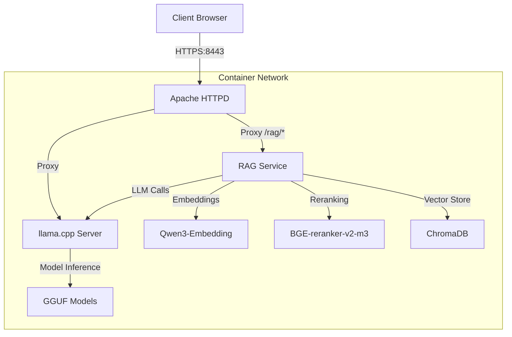

# 🦙 llama.cpp on Podman

A production-ready containerized setup for running **llama.cpp inference server** with **Retrieval-Augmented Generation (RAG)** capabilities. Features Apache HTTPD reverse proxy, ChromaDB vector store, and comprehensive security controls.

## ✨ Features

- 🦙 **LLM Inference** with llama.cpp and GGUF models
- 🧠 **RAG System** with semantic search and document Q&A
- 🔒 **Security** with HTTPS, authentication, and network isolation
- 🐳 **Containers** with Podman Compose and Kubernetes support
- 📁 **Multi-Format Support** for PDF, DOCX, TXT, and JSON documents

## 🚀 Quick Start

### Prerequisites

- **Podman** 4.0+ or Docker
- **8GB+ RAM** (for models + embeddings)
- **Linux/macOS/Windows with WSL2**

### 1. Setup

```bash
# Create required directories
mkdir -p apache/certs models rag-service/documents rag-service/data/chroma_db rag-service/models

# Set SELinux context (if SELinux is enabled on RHEL/Fedora/CentOS)
# chcon -Rt container_file_t ./rag-service/data/
# chcon -Rt container_file_t ./apache/certs/
# chcon -Rt container_file_t ./models/

# Generate SSL certificates
openssl req -x509 -nodes -days 365 -newkey rsa:2048 \
  -keyout apache/certs/server.key \
  -out apache/certs/server.crt \
  -subj "/C=US/ST=State/L=City/O=Org/OU=Unit/CN=localhost"
chmod 600 apache/certs/server.key
chmod 644 apache/certs/server.crt

# Download your GGUF model to models/ directory
wget https://huggingface.co/Qwen/Qwen2.5-0.5B-Instruct-GGUF/resolve/main/qwen2.5-0.5b-instruct-q8_0.gguf -O models/qwen2.5-0.5b-instruct-q8_0.gguf

# Download embedding and reranker models
cd rag-service/models
git clone https://huggingface.co/Qwen/Qwen3-Embedding-0.6B embedding
git clone https://huggingface.co/BAAI/bge-reranker-v2-m3 reranker
cd ../..

# Update configuration
sed -i 's|/models/Qwen3-0.6B-Q8_0.gguf|/models/qwen2.5-0.5b-instruct-q8_0.gguf|g' kube.yaml
```

### 2. Start Services

```bash
# Production mode (with network isolation)
podman network create --internal isolated
podman play kube --network isolated kube.yaml

# Development mode (without isolation)
podman play kube kube.yaml
```

### 3. Access Web Interface

🌐 **URL**: https://localhost:8443/html/index.html
🔐 **Login**: `admin` / `llama123`

## 🏗️ Architecture



## 📁 Project Structure

```
llama-cpp/
├── 🐳 Container Configs
│   ├── podman-compose.yml    # Compose deployment
│   └─── kube.yaml             # Kubernetes deployment
├── 🌐 Apache Setup
│   ├── conf/
│   │   ├── httpd.conf        # Reverse proxy + security
│   │   └── .htpasswd         # Authentication (excluded from git)
│   ├── certs/                # SSL certificates (excluded from git)
│   ├── logs/                 # Access logs
│   └── html/                 # Web applications
│       ├── index.html        # Web interface
│       ├── rag.html          # RAG interface
│       ├── proofread.html    # Text processing
│       ├── reply.html        # Email assistant
│       └── js/               # Client-side functionality
├── 🤖 Models
│   └── *.gguf               # GGUF model files (excluded from git)
├── 🧠 RAG Service
│   ├── src/
│   │   ├── main.py           # FastAPI application
│   │   ├── rag_chain.py      # RAG implementation
│   │   ├── vector_store.py   # ChromaDB integration
│   │   ├── custom_embeddings.py
│   │   ├── reranker.py
│   │   └── document_loader.py
│   ├── documents/            # Input documents (excluded from git)
│   ├── data/                 # Vector database (excluded from git)
│   ├── models/               # Embedding models (excluded from git)
│   ├── requirements.txt
│   ├── Dockerfile
│   └── README-RAG.md         # RAG-specific documentation
└── 📚 Documentation
    ├── README.md             # This file
    └── LICENSE
```

## 🛠️ Operations

### Starting and Stopping Services

```bash
# Start services
podman play kube kube.yaml

# Start with network isolation (recommended for production)
podman network create --internal isolated
podman play kube --network isolated kube.yaml

# Stop services
podman play kube --down kube.yaml

# Restart specific service
podman restart rag-service-deployment-pod-rag-service
podman restart llama-cpp-server-deployment-pod-llama-cpp-server
```

### Monitoring and Logs

```bash
# Container status
podman ps --format "table {{.Names}}\t{{.Status}}\t{{.Ports}}"

# Service logs
podman logs -f llama-cpp-server-deployment-pod-llama-cpp-server
podman logs -f rag-service-deployment-pod-rag-service
podman logs -f apache-deployment-pod-apache

# Health checks
curl -k -u admin:llama123 https://localhost:8443/health
curl -k -u admin:llama123 https://localhost:8443/rag/status
```

### Data Management

```bash
# Backup vector database
tar -czf rag-backup-$(date +%Y%m%d).tar.gz rag-service/data/

# Clear and rebuild vector store
rm -rf rag-service/data/chroma_db/

# View document stats
curl -k -u admin:llama123 https://localhost:8443/rag/status | jq '.documents'
```

## ⚙️ Configuration

### Model Configuration

Update both files with your model path:

**kube.yaml:**
```yaml
env:
- name: MODEL_FILE
  value: /models/your-model.gguf
args:
- -m
- /models/your-model.gguf
```

**podman-compose.yml:**
```yaml
environment:
  - MODEL_FILE=/models/your-model.gguf
command: >
  -m ${MODEL_FILE}
```

## 🧠 RAG System Deep Dive

### Pipeline Architecture

1. **Document Ingestion** → Text splitting → Embedding generation → Vector storage
2. **Query Processing** → Vector search → Reranking → Context generation → LLM response

### Models Used

- **Embedding**: Qwen3-Embedding-0.6B (1024-dim, multilingual)
- **Reranker**: BGE-reranker-v2-m3 (CrossEncoder, multilingual)
- **LLM**: Your GGUF model via llama.cpp

### Dependencies

The RAG service uses LangChain 0.2.16+ with modular packages:
- `langchain==0.2.16` - Core framework (auto-installs langchain-text-splitters)
- `langchain-community==0.2.16` - Community integrations (document loaders, vector stores)
- `langchain-core==0.2.38` - Base abstractions (documents, embeddings, prompts)

All imports have been updated to use the new package structure to avoid deprecation warnings.

### API Reference

<details>
<summary>Click to expand API documentation</summary>

#### RAG Endpoints

```bash
# System Status
GET /rag/status
Response: {"status": "healthy", "documents": 42, "models_loaded": true}

# Query with RAG
POST /rag/query
Body: {"question": "What is vector search?", "include_sources": true}
Response: {"answer": "...", "sources": [...]}

# Document Search
POST /rag/search  
Body: {"query": "machine learning", "k": 5}
Response: {"documents": [...]}

# Upload Documents
POST /rag/upload
Form: file=@document.pdf
Response: {"message": "Document uploaded successfully"}

# Bulk Ingest
POST /rag/ingest
Response: {"processed": 15, "failed": 0}

# Clear Database
DELETE /rag/documents
Response: {"message": "All documents cleared"}
```

#### LLM Endpoints

```bash
# Text Completion
POST /completion
Body: {"prompt": "Explain AI", "max_tokens": 256}
Response: {"content": "..."}

# Chat Completion  
POST /v1/chat/completions
Body: {"messages": [{"role": "user", "content": "Hello"}]}
Response: {"choices": [...]}
```

</details>

### Document Formats

| Format | Support | Notes |
|--------|---------|-------|
| **PDF** | ✅ Full | Text extraction, metadata preserved |
| **DOCX** | ✅ Full | Word documents, formatting stripped |
| **TXT** | ✅ Full | Plain text files |
| **JSON** | ✅ Partial | Format: `{"chunks": ["text1", "text2"]}` |

## 🔒 Security Configuration

### Development Environment

**Default Settings:**
- Self-signed SSL certificates
- Basic authentication: `admin` / `llama123`
- CORS: Allow all origins
- Network: Internet access enabled

### Production Hardening

**1. SSL Certificates:**
```bash
# Use proper certificates
cp your-cert.crt apache/certs/server.crt
cp your-key.key apache/certs/server.key
chmod 600 apache/certs/server.key
```

**2. Authentication:**
```bash
# Change default password
python3 -c "
import crypt
password = input('Enter secure password: ')
encrypted = crypt.crypt(password, crypt.mksalt(crypt.METHOD_SHA512))
print(f'admin:{encrypted}')
" > apache/conf/.htpasswd

# Add additional users
python3 -c "
import crypt
username = 'newuser'
password = 'securepass'
encrypted = crypt.crypt(password, crypt.mksalt(crypt.METHOD_SHA512))
print(f'{username}:{encrypted}')
" >> apache/conf/.htpasswd
```

**3. CORS Configuration (rag-service/src/main.py):**
```python
app.add_middleware(
    CORSMiddleware,
    allow_origins=["https://yourdomain.com"],  # Specific origins only
    allow_credentials=True,
    allow_methods=["GET", "POST"],
    allow_headers=["*"],
)
```

**4. Network Isolation:**
```bash
# Create isolated network (no internet access)
podman network create --internal isolated
podman play kube --network isolated kube.yaml
```

**5. Firewall Rules:**
```bash
sudo ufw allow 8443/tcp   # HTTPS only
sudo ufw deny 8080/tcp    # Block HTTP
sudo ufw deny 11434/tcp   # Block direct LLM access
sudo ufw deny 8081/tcp    # Block direct RAG access
```

**Security Checklist:**
- [ ] SSL certificates with proper permissions (600 for .key)
- [ ] Strong authentication credentials
- [ ] CORS configured for specific origins
- [ ] Network isolation enabled
- [ ] Firewall rules configured
- [ ] Regular security updates
- [ ] Log monitoring enabled

## 🌟 Advanced Usage

### Custom Model Integration

```bash
# Add new model
cp your-model.gguf models/
# Update kube.yaml with model path
sed -i 's|MODEL_FILE.*|MODEL_FILE=/models/your-model.gguf|g' kube.yaml
# Restart services
podman play kube --down kube.yaml
podman play kube kube.yaml
```

### Bulk Document Processing

```bash
# Upload directory of documents
for file in /path/to/docs/*; do
    curl -k -u admin:llama123 -X POST https://localhost:8443/rag/upload \
         -F "file=@$file"
done

# Or use the ingest endpoint for documents/ directory
curl -k -u admin:llama123 -X POST https://localhost:8443/rag/ingest
```

### API Integration Examples

<details>
<summary>Python Client Example</summary>

```python
import requests
from requests.auth import HTTPBasicAuth

class LlamaRAGClient:
    def __init__(self, base_url="https://localhost:8443", username="admin", password="llama123"):
        self.base_url = base_url
        self.auth = HTTPBasicAuth(username, password)
        self.session = requests.Session()
        self.session.verify = False  # For self-signed certs

    def query(self, question, include_sources=True):
        response = self.session.post(
            f"{self.base_url}/rag/query",
            json={"question": question, "include_sources": include_sources},
            auth=self.auth
        )
        return response.json()

    def upload_document(self, file_path):
        with open(file_path, 'rb') as f:
            response = self.session.post(
                f"{self.base_url}/rag/upload",
                files={"file": f},
                auth=self.auth
            )
        return response.json()

# Usage
client = LlamaRAGClient()
result = client.query("What is machine learning?")
print(result["answer"])
```

</details>

## 🚨 Troubleshooting

### Common Issues

<details>
<summary>🔧 Service Won't Start</summary>

```bash
# Check pod status
podman pod ps

# Check container logs
podman logs rag-service-deployment-pod-rag-service

# Rebuild RAG service
cd rag-service
podman build -t rag-service:latest .
podman play kube --down kube.yaml
podman play kube kube.yaml
```

</details>

<details>
<summary>🔐 Authentication Issues</summary>

```bash
# Verify password file
cat apache/conf/.htpasswd

# Recreate with new password
python3 -c "
import crypt
password = 'llama123'
encrypted = crypt.crypt(password, crypt.mksalt(crypt.METHOD_SHA512))
print(f'admin:{encrypted}')
" > apache/conf/.htpasswd

# Test authentication
curl -k -u admin:llama123 https://localhost:8443/health
```

</details>

<details>
<summary>🤖 Model Loading Problems</summary>

```bash
# Check model file exists
ls -la models/

# Verify model path in config
grep MODEL_FILE kube.yaml

# Check llama.cpp logs for errors
podman logs llama-cpp-server-deployment-pod-llama-cpp-server | grep -i error

# Test model manually
podman exec -it llama-cpp-server-deployment-pod-llama-cpp-server \
  /llama-server -m /models/your-model.gguf --help
```

</details>

<details>
<summary>🧠 RAG Issues</summary>

```bash
# Check embedding models
ls -la rag-service/models/embedding/
ls -la rag-service/models/reranker/

# Test RAG service directly
curl -k http://localhost:8081/rag/status

# Clear and rebuild vector store
rm -rf rag-service/data/chroma_db/
# Re-upload documents
```

</details>

### Performance Optimization

| Component | Memory | CPU | Storage | Notes |
|-----------|--------|-----|---------|-------|
| **llama.cpp** | 4-16GB | 4+ cores | - | Depends on model size |
| **RAG Service** | 2-4GB | 2+ cores | SSD preferred | Embedding models |
| **ChromaDB** | 1-2GB | 1+ core | SSD required | Vector operations |
| **Apache** | 512MB | 1 core | - | Reverse proxy |

**Optimization Tips:**
- Use SSD for vector database performance
- Increase `n_predict` for longer responses
- Tune `temperature` for creativity vs consistency
- Monitor memory usage during operation

## 📄 License

This project is licensed under the MIT License - see the [LICENSE](LICENSE) file for details.

## 🙏 Acknowledgments

- **llama.cpp team** for the excellent inference engine
- **ChromaDB** for the vector database
- **Qwen team** for the embedding models
- **BAAI** for the reranker models


